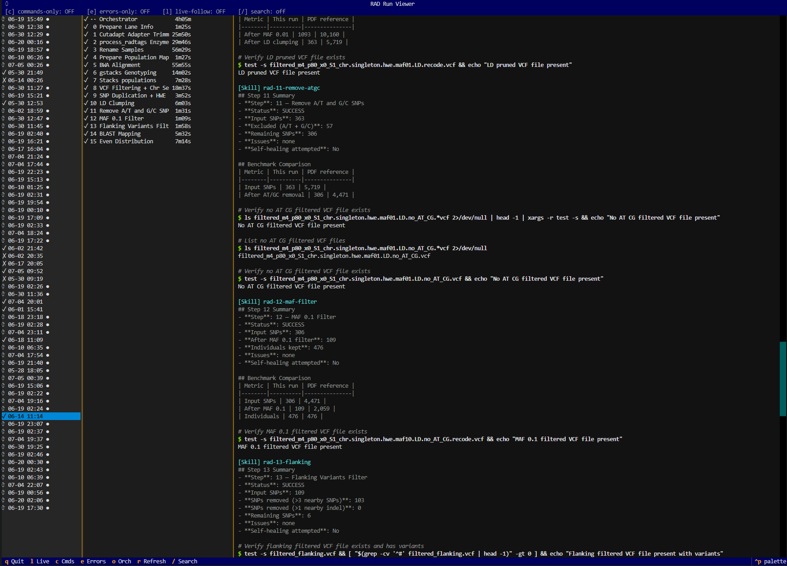

# 🤖 Agentic Scientific Pipelines

RADAgent is an agentic framework for automating end-to-end restriction site-associated DNA sequencing (RAD-seq) analysis with open-weight large language models.

<p align="center">
  
  <br>
  <em>RAD Agent CLI</em>
</p>

## 📦 Installation

Fresh-server setup is ~45–60 min, dominated by the model download.

### 1. Hardware check

```bash
nvidia-smi                      # need ≥30 GB VRAM total (e.g. A100 40GB/80GB)
df -h ~                         # need ≥30 GB free disk for the model cache (bf16 weights ~28 GB)
free -h                         # need ≥32 GB RAM
nvidia-smi | grep "Driver Ver"  # need a driver supporting CUDA 11.8+ (driver ≥ 470)
```

If the card has < 30 GB VRAM, the bf16 model won't fit — use a smaller variant or
multi-GPU (not covered here).

### 2. System + bioinformatics tools

`setup.sh` does **not** install these (they need `sudo` and are OS-specific). On Ubuntu/Debian:

```bash
sudo apt update
sudo apt install -y \
    python3.11 python3.11-venv python3-pip \
    bwa samtools bcftools vcftools \
    ncbi-blast+ cutadapt parallel perl r-base git curl
```

**Stacks 2.x** (`process_radtags`, `gstacks`, `populations`) — apt ships v1, you need v2:

```bash
conda install -c bioconda stacks=2.66
```

**plink2:** `conda install -c bioconda plink2` (or download from
<https://www.cog-genomics.org/plink/2.0/>).

**R package `bigsnpr`** (step 10):

```bash
sudo R -e 'install.packages("bigsnpr", repos="https://cloud.r-project.org")'
```

Verify everything is on `$PATH`:

```bash
for tool in bwa samtools bcftools vcftools blastn makeblastdb cutadapt parallel \
            process_radtags gstacks populations plink2 Rscript perl python3.11; do
  command -v "$tool" >/dev/null && echo "OK   $tool" || echo "MISS $tool"
done
```

Resolve any `MISS` before continuing.

### 3. Python venv + model (automated)

```bash
git clone <your-repo-url> os_rad_data
cd os_rad_data
bash setup.sh
```

`setup.sh` is idempotent and will: verify hardware/driver/Python, warn about any missing
bioinformatics tools, create `.venv/` with the pinned `torch` + `transformers==4.55.4`,
install the agent (`pip install -e ./agent`, which pulls `accelerate`/`huggingface_hub`/
`textual`/`rich`), then pre-download the ~28 GB bf16 model.

<details>
<summary>Manual Python install (if you'd rather not use setup.sh)</summary>

```bash
python3.11 -m venv .venv
.venv/bin/pip install --upgrade pip
# torch — cu118 wheels are forward-compatible with any driver ≥ 470:
.venv/bin/pip install torch==2.7.1 torchvision==0.22.1 torchaudio==2.7.1 \
    --index-url https://download.pytorch.org/whl/cu118
# pin transformers to the validated release first, so pip won't pull an untested 5.x:
.venv/bin/pip install "transformers==4.55.4"
.venv/bin/pip install -e ./agent   # pulls accelerate, huggingface_hub, textual, rich
.venv/bin/huggingface-cli download microsoft/Phi-4
```
</details>

The `./rad` wrapper calls the venv binaries directly — you never need to
`source .venv/bin/activate`.

### 4. Add your data

```
02-raw/                        # ** your raw paired-end FASTQs **
├── SAMPLE001_1.fastq.gz       #    forward reads (_1)
├── SAMPLE001_2.fastq.gz       #    reverse reads (_2)
└── ...
08-genome/genome.fasta         # ** your reference genome **
01-info_files/
├── sample_information.csv      # ** you provide — sample/population map (see below) **
└── adapters.fasta             #    cutadapt adapters (default shipped; replace if needed)
```

BWA and BLAST indexes for the genome are built automatically by the pipeline if missing
(or build them once yourself: `bwa index 08-genome/genome.fasta` and
`makeblastdb -dbtype nucl -in 08-genome/genome.fasta -input_type fasta -title genome.fasta`).

**`sample_information.csv` format** — one row per sample:

```csv
#Lane,Barcode,Population,Sample,PopulationID,PlatePosition,,
SRR30282941,TGACACC,P01,ROW-04-22,1,A01,,Notes
SRR30282940,CTCACT,P01,ROW-05-22,1,A02,,DO NOT modify the column titles in the header line
```

- Don't modify the header titles or the order of the first six columns.
- Use plate-position format `A01`, not `A1`.
- Lane names must match your FASTQ prefixes (without `_1.fastq.gz`).

### 5. Sanity-check

There is no server to start — the model loads in-process on the first agent call.

```bash
./rad status
```

Expected `./rad status`:

```
Project root: /path/to/os_rad_data
Skills dir:   /path/to/os_rad_data/.claude/skills
Model id:     microsoft/Phi-4
Torch dtype:  auto
Device map:   auto
Max ctx tok:  32768
GPU free MB:  80000      ← the card should be ~empty before the first run
```

The GPU should be nearly empty here; the ~28 GB load happens when you launch the
orchestrator (or `./rad run`). Make sure no other process is holding VRAM.

---

## 🚀 Quick Start

```bash
./rad status           # sanity check — prints model id + GPU free

# run the full pipeline in the background, logging to .rad/ (gives the viewer a session log)
# the model loads in-process on the first call (a few minutes), then stays resident
nohup ./rad orchestrator > .rad/orchestrator-$(date +%Y%m%d-%H%M%S).log 2>&1 &

./rad view             # watch it live in the TUI
```

---

Running the pipeline

```bash
# Full pipeline (16 steps), in the background, logging to .rad/ so the viewer sees the run:
nohup ./rad orchestrator > .rad/orchestrator-$(date +%Y%m%d-%H%M%S).log 2>&1 &
echo "PID: $!"
```

**Monitor** (in another terminal) — the richest option is the TUI (`./rad view`); for a
plain tail:

```bash
tail -F rad-pipeline.log        # real per-step log with timestamps + status
pgrep -af rad-agent             # confirm the agent process is alive
```

**When it finishes:**

```bash
grep -cv '^#' final_snp_panel.vcf    # SNP count (typical: 100–300)
head final_snp_panel_summary.txt     # per-chromosome summary
cat rad-pipeline-timing.csv          # per-step duration + token usage
```

---

## 💻 Viewing runs (`./rad view`)

A live, keyboard-driven terminal UI for browsing pipeline runs recorded under `.rad/` —
both **while a run is in progress** and **after it finishes**. It replaces the old
`browse_transcripts.py` script.

```bash
./rad view                 # open the live run if one is active, else the most recent
./rad view e24cd335        # open a specific run by session-id prefix
./rad view --no-live       # static mode (no background polling)
```

### Keys

| Key | Action |
|---|---|
| `↑` `↓` | Move within the focused list (the view updates as you move) |
| `Tab` / `Shift+Tab` | Switch focus between the Runs / Steps / Detail panes |
| `c` | **Commands-only** — show just the `$ command` lines |
| `e` | **Errors-only** — show only commands/results that failed (`[exit N]`, timeouts) |
| `/` | **Search** within the detail pane (Enter applies, `Esc` clears) |
| `o` | Jump to the **Orchestrator lane** — what the controller did to launch/verify/retry steps |
| `l` | Toggle **live-follow** (auto-refresh + tail the active step) |
| `r` | Refresh from disk now |
| `q` | Quit |

`c` and `e` are mutually exclusive (turning one on turns the other off — the status bar
shows it). Moving the cursor manually turns live-follow off so a refresh won't yank you
away; press `l` to re-engage.

---

## 🧩 Pipeline steps

| Step | Skill | Description | Est. time |
|------|-------|-------------|-----------|
| 0 | `rad-0-lane-info` | Parse FASTQs to generate the lane-info list | 5s |
| 1 | `rad-1-cutadapt` | Trim Illumina adapters (parallel) | ~10min |
| 2 | `rad-2-radtags` | Enzyme filtering with `process_radtags` (parallel) | ~30min |
| 3 | `rad-3-rename` | Rename per-lane outputs to per-sample names | 10s |
| 4 | `rad-4-popmap` | Generate the population map from the sample CSV | 1s |
| 5 | `rad-5-bwa` | Align to the reference with BWA-MEM (parallel) | ~1-2hr |
| 6 | `rad-6-gstacks` | Reference-based genotyping | ~30-60min |
| 7 | `rad-7-populations` | Population-level filtering and export | ~10-30min |
| 8 | `rad-8-vcf-filter` | VCF filtering + chromosome selection | ~1min |
| 9 | `rad-9-snp-dup-hwe` | SNP duplication detection + HWE filtering | ~2min |
| 10 | `rad-10-ld-clump` | Linkage-disequilibrium pruning (`bigsnpr`) | ~5min |
| 11 | `rad-11-remove-atgc` | Remove strand-ambiguous A/T and G/C SNPs | 5s |
| 12 | `rad-12-maf-filter` | Minor-allele-frequency filter (MAF ≥ 0.1) | 5s |
| 13 | `rad-13-flanking` | Remove SNPs in complex/duplicated regions | 10s |
| 14 | `rad-14-blast-map` | BLAST validation of SNP uniqueness | ~2min |
| 15 | `rad-15-even-dist` | Select the final panel with even chromosome coverage | 5s |

---

## ⚙️ `./rad` command reference

```bash
./rad status                      # environment + model/GPU info + recent sessions
./rad view [session] [--no-live]  # browse runs in the TUI
./rad orchestrator                # run the full pipeline (steps 0-15)
./rad orchestrator 5              # resume from step 5
./rad orchestrator 8 --only       # run only step 8
./rad orchestrator 8 --only --clean   # clean step 8 outputs first, then run it
./rad run rad-5-bwa               # run one skill standalone (no orchestrator)
./rad debugger 9 "vcftools error" # manually invoke the autonomous debugger on a step
```

**Cleaning outputs:**

```bash
bash clean_pipeline.sh all        # wipe ALL pipeline outputs (keeps raw data)
bash clean_pipeline.sh 5          # clean only step 5
bash clean_pipeline.sh 5-10       # clean steps 5 through 10
bash clean_pipeline.sh indexes    # clean BWA + BLAST indexes (expensive to rebuild)
```

**Resetting the Python env** (separate from pipeline data — wipes `.venv/` + caches):

```bash
bash clean_env.sh                 # then re-run `bash setup.sh` to rebuild
```

---
